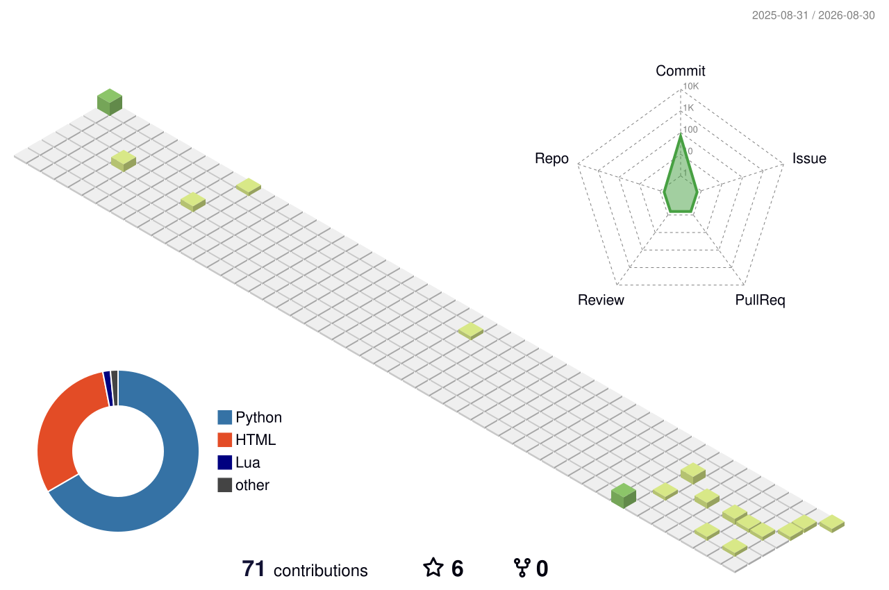

<picture>
  <source media="(prefers-color-scheme: dark)" srcset="https://capsule-render.vercel.app/api?type=waving&color=0:8b5cf6,50:3b82f6,100:06b6d4&height=220&section=header&text=Hello%2C%20I'm%20Yiyi%20L%20%F0%9F%92%AB&fontSize=42&fontColor=ffffff&animation=fadeIn&fontAlignY=32&desc=Code%20%C2%B7%20Create%20%C2%B7%20Explore&descAlignY=55&descSize=18" />
  
</picture>

## 🌟 About Me · 关于我

> A software developer with a deep passion for computer science and programming. Continuously exploring emerging technologies and tackling intricate problems are my driving forces.
>
> 一个热爱计算机科学与编程的软件开发者，持续探索新技术、攻克难题。用代码创造有影响力、有价值的解决方案，就是我前进的动力。

- 🔭 **Now / 现在** — Building web apps with **Python · Django · FastAPI**, exploring **LLM & RAG** with LlamaIndex
- 🌱 **Learning / 学习中** — 大模型应用开发 · RAG · Agent
- 💬 **Ask me about / 可以聊** — Python, Django, Java, SpringBoot
- ⚡ **Fun fact / 彩蛋** — [https://folio-iota.vercel.app/](https://folio-iota.vercel.app/) is very interesting

## 🛠️ Tech Stack · 技术栈

<picture>
  <source media="(prefers-color-scheme: dark)" srcset="https://skillicons.dev/icons?i=python,django,fastapi,java,spring,git,github,linux&theme=dark" />
  
</picture>

## 📊 GitHub Stats · 数据面板

<picture>
  <source media="(prefers-color-scheme: dark)" srcset="https://github-readme-stats-sigma-five.vercel.app/api?username=611de&show_icons=true&hide_border=true&bg_color=0d1117&title_color=8b5cf6&icon_color=06b6d4&text_color=c9d1d9" />
  
</picture>
<picture>
  <source media="(prefers-color-scheme: dark)" srcset="https://github-readme-stats-sigma-five.vercel.app/api/top-langs/?username=611de&hide_border=true&layout=compact&bg_color=0d1117&title_color=8b5cf6&text_color=c9d1d9" />
  
</picture>

<picture>
  <source media="(prefers-color-scheme: dark)" srcset="https://streak-stats.demolab.com?user=611de&hide_border=true&background=0d1117&ring=8b5cf6&fire=f97316&currStreakLabel=8b5cf6&sideLabels=06b6d4&currStreakNum=c9d1d9&sideNums=c9d1d9&dates=8b949e" />
  
</picture>

<picture>
  <source media="(prefers-color-scheme: dark)" srcset="https://github-profile-summary-cards.vercel.app/api/cards/productive-time?username=611de&theme=github_dark&utcOffset=8" />
  
</picture>

## 🌌 3D Contribution · 立体贡献城市

<picture>
  <source media="(prefers-color-scheme: dark)" srcset="./profile-3d-contrib/profile-night-rainbow.svg" />
  
</picture>

## 🐍 Contribution Snake · 贪吃蛇

<picture>
  <source media="(prefers-color-scheme: dark)" srcset="https://raw.githubusercontent.com/611de/611de/output/github-snake-dark.svg" />
  <source media="(prefers-color-scheme: light)" srcset="https://raw.githubusercontent.com/611de/611de/output/github-snake.svg" />
  
</picture>

